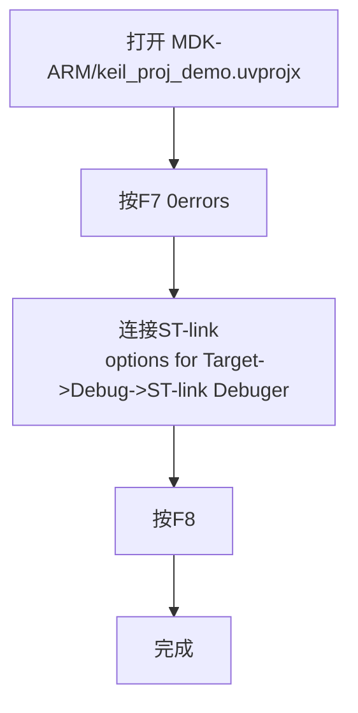

# 8.7学习日志
## 任务进行流程

## 理解F7 F8的作用
### F7
预处理（读取.h)
→ 编译(检查语法 转换成机器代码.c->.o)
→ 汇编(启动和文件初始化.s->.o)
→ 链接(连接调用关系 生成.axf)
→ 可选的 HEX 转换(开启create HEX file后生成的记录)
## F8
> 读取电脑中的程序映像
→ 连接STM32
→ 擦除需要修改的Flash区域
→ 写入机器指令和数据
→ 校验写入结果
## 移除buzzer.c
> Build started: Project: keil_proj_demo
*** Using Compiler 'V6.18', folder: 'D:\keil\ARM\ARMCLANG\Bin'
Build target 'keil_proj_demo'
linking...
keil_proj_demo\keil_proj_demo.axf: Error: L6218E: Undefined symbol buzzer_init (referred from main.o).
keil_proj_demo\keil_proj_demo.axf: Error: L6218E: Undefined symbol buzzer_on (referred from main.o).
keil_proj_demo\keil_proj_demo.axf: Error: L6218E: Undefined symbol buzzer_off (referred from main.o).
Not enough information to list image symbols.
Not enough information to list load addresses in the image map.
Finished: 2 information, 0 warning and 3 error messages.
"keil_proj_demo\keil_proj_demo.axf" - 3 Error(s), 0 Warning(s).
Target not created.
Build Time Elapsed:  00:00:00
## 移除led.c
>Build started: Project: keil_proj_demo
*** Using Compiler 'V6.18', folder: 'D:\keil\ARM\ARMCLANG\Bin'
Build target 'keil_proj_demo'
linking...
keil_proj_demo\keil_proj_demo.axf: Error: L6218E: Undefined symbol buzzer_init (referred from main.o).
keil_proj_demo\keil_proj_demo.axf: Error: L6218E: Undefined symbol buzzer_on (referred from main.o).
keil_proj_demo\keil_proj_demo.axf: Error: L6218E: Undefined symbol buzzer_off (referred from main.o).
Not enough information to list image symbols.
Not enough information to list load addresses in the image map.
Finished: 2 information, 0 warning and 3 error messages.
"keil_proj_demo\keil_proj_demo.axf" - 3 Error(s), 0 Warning(s).
Target not created.
Build Time Elapsed:  00:00:00
## 移除buzzer.h led.h
> Build started: Project: keil_proj_demo
*** Using Compiler 'V6.18', folder: 'D:\keil\ARM\ARMCLANG\Bin'
Build target 'keil_proj_demo'
../Core/Src/main.c(37): error: 'buzzer.h' file not found
#include "buzzer.h"   /* 铚傞福鍣ㄩ┍鍔ㄧ殑鍑芥暟澹版槑 */
         ^~~~~~~~~~
1 error generated.
compiling main.c...
compiling stm32h7xx_it.c...
compiling stm32h7xx_hal_hsem.c...
compiling stm32h7xx_hal_tim_ex.c...
../user/src/user_beep.c(7): error: 'buzzer.h' file not found
#include "buzzer.h"
         ^~~~~~~~~~
1 error generated.
compiling user_beep.c...
compiling stm32h7xx_hal_exti.c...
../hardware/src/buzzer.c(5): error: 'buzzer.h' file not found
#include "buzzer.h"
         ^~~~~~~~~~
1 error generated.
compiling buzzer.c...
../hardware/src/led.c(5): error: 'led.h' file not found
#include "led.h"
         ^~~~~~~
1 error generated.
compiling led.c...
compiling stm32h7xx_hal_pwr_ex.c...
compiling stm32h7xx_hal_mdma.c...
compiling system_stm32h7xx.c...
compiling stm32h7xx_hal_flash.c...
compiling stm32h7xx_hal_rcc.c...
compiling stm32h7xx_hal_pwr.c...
compiling stm32h7xx_hal_tim.c...
compiling stm32h7xx_hal_msp.c...
compiling gpio.c...
compiling stm32h7xx_hal_i2c_ex.c...
compiling stm32h7xx_hal_gpio.c...
compiling stm32h7xx_hal_cortex.c...
compiling stm32h7xx_hal.c...
compiling stm32h7xx_hal_flash_ex.c...
compiling stm32h7xx_hal_dma_ex.c...
compiling stm32h7xx_hal_rcc_ex.c...
compiling stm32h7xx_hal_dma.c...
compiling stm32h7xx_hal_i2c.c...
"keil_proj_demo\keil_proj_demo.axf" - 4 Error(s), 0 Warning(s).
Target not created.
Build Time Elapsed:  00:00:02
### 总结
> Include Paths 负责让编译器找到 .h 头文件，Group 里的 .c 负责提供函数实现
## 修改延时现象
发现灯闪烁速度变慢
## 遇到错误
1. 添加user/inc忘点OK 
> cannot open file '...\Core\Src\buzzer.h'
2. 首次按F7编译时选择了zip文件 存在52errors
> error: no such file or directory:
